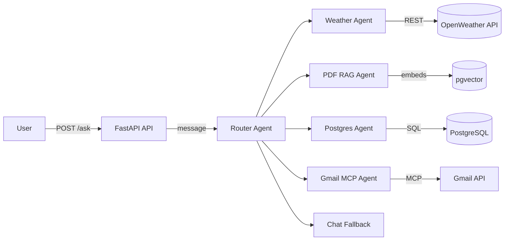

# Agentic AI Demo

Multi-agent LangGraph demo powered by FastAPI, Ollama, and pgvector.

## Architecture Diagram


## Features
- LangGraph routing across weather, PDF RAG, SQL, Gmail, and chat agents.
- Ollama-backed chat + embeddings (default: `qwen3-vl:8b` at `http://103.99.186.243:11434`).
- PDF ingestion into pgvector with similarity search.
- FastAPI endpoints for chat, weather, and PDF upload.
- Structured JSON logging via structlog.

## Setup
1) Create env & install deps  
```bash
python3 -m venv venv
source venv/bin/activate
pip install -r requirements.txt
```  
`gmail-mcp-client` is not on PyPI; install from source if required.

2) Environment variables (example `.env`)  
```
OLLAMA_SERVER=http://103.99.186.243:11434
OLLAMA_MODEL=qwen3-vl:8b
OPENWEATHER_API_KEY=your_key
POSTGRES_USER=postgres
POSTGRES_PASSWORD=postgres
POSTGRES_HOST=localhost
POSTGRES_PORT=5432
POSTGRES_DB=postgres
PGVECTOR_TABLE=pdf_vectors
LOG_LEVEL=INFO

# OAuth (one-touch) for MCP providers
SLACK_CLIENT_ID=
SLACK_CLIENT_SECRET=
SLACK_REDIRECT_URI=ohgrt://oauth/slack

GOOGLE_OAUTH_CLIENT_ID=
GOOGLE_OAUTH_CLIENT_SECRET=
GOOGLE_OAUTH_REDIRECT_URI=ohgrt://oauth/google
GOOGLE_GMAIL_SCOPES=https://www.googleapis.com/auth/gmail.readonly
GOOGLE_DRIVE_SCOPES=https://www.googleapis.com/auth/drive.readonly

# Legacy/optional tokens
SLACK_TOKEN=                # if you still use direct token posting
CONFLUENCE_BASE_URL=
CONFLUENCE_USER=
CONFLUENCE_API_TOKEN=

# GMC (legacy)
GMAIL_MCP_ENDPOINT=http://localhost:8001
GMAIL_MCP_API_KEY=your_token

# JWT/Firebase/etc
JWT_SECRET_KEY=your-secret
JWT_ALGORITHM=HS256
JWT_ACCESS_TOKEN_EXPIRE_MINUTES=15
JWT_REFRESH_TOKEN_EXPIRE_DAYS=7
FIREBASE_CREDENTIALS_PATH=firebase-credentials.json
```

3) Postgres + pgvector  
```sql
CREATE EXTENSION IF NOT EXISTS vector;
CREATE TABLE pdf_vectors (
   id SERIAL PRIMARY KEY,
   text TEXT,
   embedding vector(1536)
);
```

4) Run API  
```bash
uvicorn app.main:app --reload --host 0.0.0.0 --port 8000
```

## API Endpoints
- `POST /ask` → `{"message": "text"}` → routes through LangGraph and returns agent output.
- `POST /pdf/upload` → multipart PDF file; ingests into pgvector.
- `GET /weather?city=London` → direct weather fetch.

## Example Queries
- Weather: “What’s the weather in Paris?”
- PDF RAG: “Summarize the onboarding PDF about security.”
- SQL: “How many users signed up last week?”
- Gmail: “Show unread emails from Alice last week.”
- Chat: “Tell me a fun fact about LangGraph.”

## Agents
- **Router**: Classifies into `[weather, pdf, sql, gmail, chat]`.
- **Weather**: Calls OpenWeather via `WeatherService`.
- **PDF RAG**: Loads `data/pdfs`, chunks, embeds via Ollama, stores/queries pgvector.
- **Postgres**: NL → SQL via LangChain `SQLDatabaseChain`, safety guard against destructive queries.
- **Gmail MCP**: Queries inbox via Gmail MCP client (requires external package).
- **Chat**: Generic LLM fallback.

## RAG Flow
1) Upload PDF → stored in `data/pdfs`.  
2) Load with PyPDF, chunk, embed via Ollama embeddings.  
3) Persist embeddings to pgvector table.  
4) Queries run pgvector similarity search → context → LLM answer.

## Logging
- JSON logs via structlog.
- Key events: routing decisions, agent entry/exit, weather calls, SQL queries (scrubbed), RAG retrieval scores, Gmail calls, ingestion steps.

## Troubleshooting
- **Dependencies**: If installs time out, retry `pip install -r requirements.txt` on a stable connection.
- **Postgres**: Ensure `pg_hba.conf` allows connections and `vector` extension exists.
- **Ollama**: Verify the model is pulled on the Ollama host (`ollama pull qwen3-vl:8b`) and set `OLLAMA_SERVER`.
- **Slack (one-touch)**:
  1) In Slack app settings, add redirect `ohgrt://oauth/slack`.
  2) Set `SLACK_CLIENT_ID/SLACK_CLIENT_SECRET/SLACK_REDIRECT_URI` in `.env`.
  3) Connect Slack from the iOS app MCP config; tokens save to `integration_credentials`.
- **Google (Gmail/Drive one-touch)**:
  1) In Google Cloud Console, create OAuth client; set redirect `ohgrt://oauth/google`.
  2) Enable Gmail API and Drive API. Set `GOOGLE_OAUTH_CLIENT_ID/SECRET/REDIRECT_URI` and scopes in `.env`.
  3) Connect Gmail/Drive from the iOS app; tokens save to `integration_credentials`.
- **Gmail (legacy MCP client)**:
  1) Enable Gmail API, create OAuth “Desktop” credentials, download as `credentials.json` (path via `GMAIL_CREDENTIALS_FILE`).
  2) Start the app, trigger a Gmail query, approve; `token.json` is saved (path via `GMAIL_TOKEN_FILE`).
  3) Keep both files out of version control; rotate if compromised.
- **Database seed**: To load demo tables/data, run `psql -h <host> -U <user> -d <db> -f data/db/seed.sql`. Adjust `.env` to point to that database.
- **JIRA MCP**: Placeholder only; wire in your JIRA MCP client and set `JIRA_MCP_ENDPOINT`/`JIRA_MCP_API_KEY` in `.env` to enable JIRA tools.
- **Slack/Confluence**: Set `SLACK_TOKEN` for Slack posting; set `CONFLUENCE_BASE_URL`, `CONFLUENCE_USER`, `CONFLUENCE_API_TOKEN` for Confluence search. Tools will respond with a not-configured message if unset.
- **Web crawl**: Uses simple HTTP fetch (first ~800 chars). Ensure network access is permitted in your environment.
